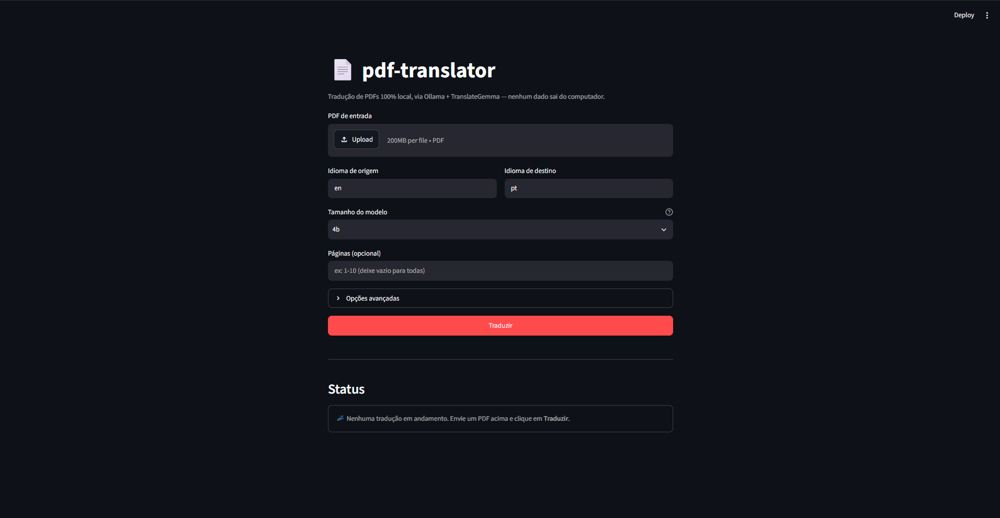
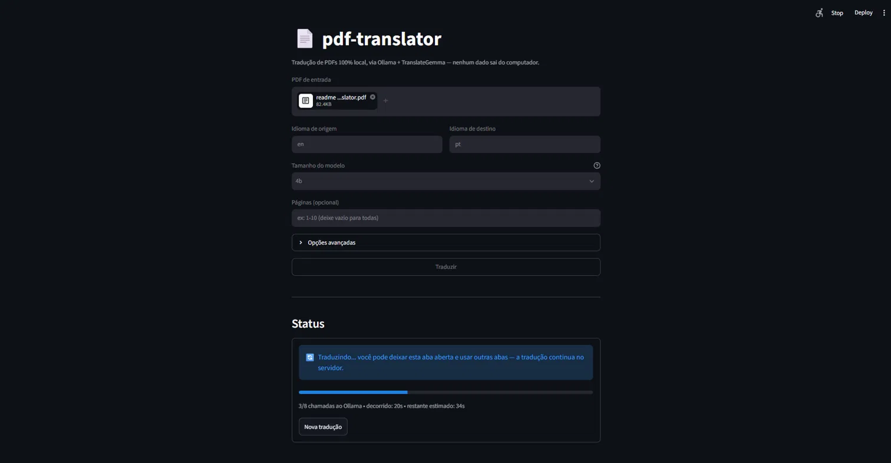
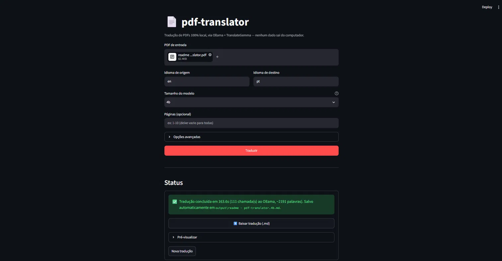
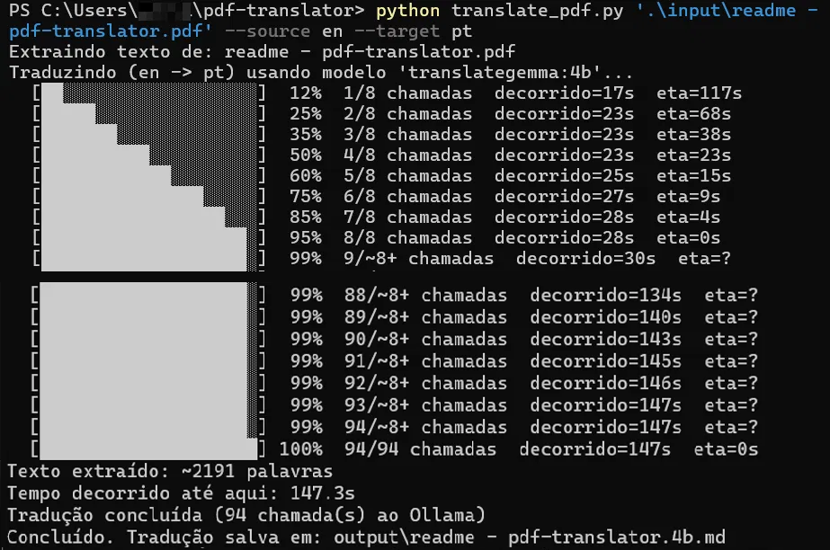

# pdf-translator

[](LICENSE)
[](https://www.python.org/)

100% local PDF translation, with no dependency on any external API or cloud service.
Extracts text from a PDF and translates it using [TranslateGemma](https://ollama.com/library/translategemma)
running via [Ollama](https://ollama.com), saving the result as Markdown.

## Screenshots

<p align="center">
  
  
  
</p>

## Why

Cloud translation tools (Google Translate, DeepL, etc.) require sending the
document's content to third-party servers — inconvenient for sensitive,
academic, or institutional material. This project runs entirely on your
machine: no data ever leaves your computer.

## How it works

1. **Extraction** (`pypdf`) — reads the text from each page of the PDF.
2. **Paragraph reconstruction** — joins lines that are just visual column
   breaks (common in two-column academic PDFs), fixing line-break
   hyphenation, so the text flows like normal prose before being translated.
3. **Translation** (`polyglot-gpu` + Ollama) — sends the text in chunks to
   TranslateGemma, running locally via Ollama, preserving the Markdown
   structure.
4. **Output** — saves the result as `.md`, with a header indicating the
   languages and model used.

This logic lives in `translator_core.py` and is used by both the CLI
(`translate_pdf.py`) and the [web interface](#web-interface)
(`web_app.py`) -- pick whichever you prefer, the underlying engine is the same.

## Requirements

- Python 3.10+
- [Ollama](https://ollama.com/download) installed and running
- TranslateGemma model downloaded (the command below downloads the `4b`
  size, used by default):
  ```bash
  ollama pull translategemma
  ```
  To use `--model-size 12b` or `27b`, download the corresponding size first
  (otherwise the script fails with a "model not found" error):
  ```bash
  ollama pull translategemma:12b
  ollama pull translategemma:27b
  ```

## Installation

```bash
git clone https://github.com/PGC13/pdf-translator.git
cd pdf-translator

# Optional, but recommended: isolate dependencies in a virtual environment
python -m venv .venv
source .venv/bin/activate      # Windows: .venv\Scripts\activate

pip install -r requirements.txt
```

### Folder structure

```
pdf-translator/
├── input/     # put the PDFs you want to translate here
├── output/    # translations (.md) are saved here
├── translator_core.py   # shared logic (extraction + translation)
├── translate_pdf.py     # command-line interface
├── web_app.py            # web interface (Streamlit)
└── web_app.log            # web interface log (generated at runtime, not versioned)
```

## Web Interface

Besides the command line, the project has a Streamlit web interface --
single page, no login (local use), with a live progress bar:

```bash
streamlit run web_app.py
```

Opens at `http://localhost:8501`. Translation runs in a background thread:
you can switch tabs or minimize the browser and it keeps going -- the page
just polls the progress periodically. When it finishes, a download button
for the `.md` appears, along with a preview of the result, and the file has
already been saved automatically to `output/<pdf_name>.<model-size>.md`
(same naming convention as the CLI).

**Current limitation:** there's no way to cancel a translation in progress
from the interface -- you can only start a new one after the current one
finishes (successfully or with an error).

The extraction and translation logic (including the bug fixes described
further below) lives in `translator_core.py`, used by both the CLI and the
web interface -- no duplication, one fix covers both.

<details>
<summary><strong>Logs, the progress bug fix, and why there's no executable (click to expand)</strong></summary>

### Logs

The web interface writes a detailed log to `web_app.log` (created in the
project folder when run), covering both the main page and the background
translation thread -- useful for diagnosing any freeze or unexpected
behavior without depending only on what shows up on screen. To follow it
in real time:

```powershell
# Windows (PowerShell)
Get-Content web_app.log -Wait
```
```bash
# Linux/macOS
tail -f web_app.log
```

### Bug found and fixed: progress wasn't updating on screen

In an early version, translation progress was stored in a plain Python
dictionary, in memory, at module level. The job was created correctly
(confirmed via logging), but reading it right after an `st.rerun()` no
longer found it -- the dictionary didn't reliably survive between
successive script executions in that environment. As a result, the screen
stayed stuck showing "no translation in progress" even while the
translation was running (and finishing correctly) in the background.

The fix: each translation's state is now persisted as **JSON files on
disk** (in the system's temp folder), not in memory. This eliminates the
problem entirely, since it doesn't depend on any Python variable surviving
between script executions -- only on files existing on disk, which is
always reliable. This same mechanism is also what lets the interface
reconnect to the correct progress even after an F5 refresh in the middle
of a long translation.

### About double-click shortcuts / executables

We tried creating `.bat`/`.vbs` shortcuts to launch the web interface with
a double click, without needing to type any command. We abandoned that
idea: on Windows 11 with **Smart App Control** enabled (common on machines
with a stricter security posture), these files are blocked by default --
and unlike regular Defender, Smart App Control doesn't have an easy
exception to grant (disabling it requires reinstalling Windows).

For the same reason, we also didn't package a "real" `.exe` via
PyInstaller: besides suffering the same kind of block (or worse, since
packaged executables are a classic target for antivirus heuristic false
positives, requiring a paid code-signing certificate to reliably avoid
this), Ollama would still be an external dependency regardless, so it
would never truly be "standalone" anyway.

The direct command below is simple, transparent, and doesn't run into any
of these restrictions:

```bash
streamlit run web_app.py
```

</details>

## Usage (command line)

```bash
python translate_pdf.py input/entrada.pdf --source en --target pt
```

<p align="center">
  
</p>

The result is saved automatically to `output/entrada.<model-size>.md`
(e.g. `entrada.4b.md`). Use `--out` to choose a different path.

### Options

| Flag | Description | Default |
|---|---|---|
| `--source` | Source language code | `en` |
| `--target` | Target language code | `pt` |
| `--out` | Output `.md` path | `output/<pdf_name>.<model-size>.md` (e.g. `artigo.4b.md`) |
| `--pages` | Page range, e.g. `1-10` | all |
| `--model-size` | `4b`, `12b`, or `27b` | `4b` |
| `--chunk-size` | Maximum size (characters) of each chunk sent to the model at a time | automatic (2000/4000/6000 depending on the model) |
| `--timeout` | Maximum time (seconds) to wait per call to Ollama | 60s (library default) -- see the "Timeout" section below |

### Examples

```bash
# Translate a whole paper from English to Portuguese (automatic output:
# output/paper.4b.md)
python translate_pdf.py input/paper.pdf --source en --target pt

# Translate only the first 5 pages, with the larger model (better quality;
# requires 'ollama pull translategemma:12b' first, and a generous --timeout)
python translate_pdf.py input/paper.pdf --source en --target pt --pages 1-5 --model-size 12b --timeout 600

# Save to a specific location
python translate_pdf.py input/paper.pdf --source en --target es --out output/traduzido.md
```

## Limitations

- Only works with PDFs that already have extractable text (not
  scanned/image-based). For scanned PDFs, OCR (e.g. Tesseract) is required
  before running this script.
- Translation time varies a lot depending on the model size and how much of
  it fits in the GPU's VRAM -- see the "Which model size to choose" section
  below for real measured numbers.

### PDFs in columns (academic papers)

Academic paper PDFs often have text in two columns, and extraction tools
(`pypdf`) capture the text respecting the *visual* line breaks of each
column, not the actual sentence or paragraph breaks. Without correction,
this would result in a "choppy" translation -- each line of the PDF turning
into a separate line in the Markdown, and hyphenated end-of-line words
(e.g. "compre-ensão") being preserved incorrectly.

The script already corrects this automatically: before translating, it
joins consecutive lines from the PDF (which are just visual column breaks)
into a single continuous text sequence, removing line-break hyphenation.
It only treats blank lines already present in the extraction as real
paragraph breaks.

<details>
<summary><strong>Technical note: why not detect paragraphs by line length</strong></summary>

**Technical note:** an earlier version tried to automatically detect the
end of each paragraph by line length ("a line much shorter than the page's
standard width"). This seemed to work in synthetic tests, but failed on
real PDFs -- title, authors, and body text have quite different line widths
on the same page, which caused excessive fragmentation (one "paragraph" per
sentence) and, as a side effect, more than a 10x increase in the number of
API calls (each small fragment became a separate call to Ollama). The
current, simpler approach avoids this problem: it joins everything that
doesn't have an explicit blank-line break, even if that occasionally joins
a title/author list to the following paragraph instead of keeping them
separate.

</details>

<details>
<summary><strong>📊 Which model size to choose — full benchmarks (click to expand)</strong></summary>

## Which model size to choose

We tested all three sizes translating the same complete academic paper
(~15,600 words, 22 pages) on an 8 GB GPU (RTX 4060). Results:

| Model | Total time | Avg time/call | CPU/GPU | Notes |
|---|---|---|---|---|
| `4b` | ~7.2 min | ~10s | 100% GPU | Runs entirely on the GPU. Fast and stable. |
| `12b` | ~49.6 min | ~74s | 39%/61% CPU/GPU | Doesn't fully fit in VRAM, but reasonably balanced. |
| `27b` | ~3h 5.6min | ~464s | 71%/29% CPU/GPU | Most processing on CPU. Only 24 calls (vs. 43 for `4b`), but each much slower -- still the most complete at preserving footnotes/captions. |

`12b`/`27b` time **varies quite a bit** depending on whatever else is
competing for VRAM at the time (browser with many tabs, other programs) --
we measured `12b` anywhere between ~50 and ~80 minutes on the same
document, depending on that. Closing GPU-using applications before running
can significantly reduce total time for these models.

In an earlier test with a short excerpt (abstract + introduction), `27b`
translated more completely and consistently than `4b` -- and the test with
the full document (table above) confirmed that advantage, preserving
content (author footnote, figure caption) that earlier extractions with
`4b`/`12b` had lost. `12b`, however, didn't repeat that advantage in an
earlier test: it made a punctuation error and was inconsistent translating
a technical acronym (mixed "NLU" and "CLN" in the same document, while `4b`
stayed consistent). In other words, more parameters doesn't always mean a
better translation in practice -- it depends on the excerpt and on how the
model behaves running partially on CPU.

Practical recommendation, for this hardware range (8 GB GPU):

- **`4b`** — default model for most cases. Fast, runs entirely on the GPU,
  and showed no loss of completeness in full-document tests.
- **`12b` / `27b`** — reserve for when completeness/terminology matters more
  than speed (e.g. dense academic material with many footnotes and
  citations). Expect much longer times -- `27b` took ~3h for the same
  document `4b` translates in ~7 minutes. Always use a generous `--timeout`
  (see below).

If your GPU has enough VRAM to run `12b` or `27b` entirely on it (without
falling back to CPU), the times above don't apply -- in that case the
larger models tend to be more worth the extra time cost.

### Timeout: when you need `--timeout`

The `polyglot-gpu` library uses, by default, a 60-second timeout per call
to Ollama. That's enough for `4b` (which generates each chunk in seconds),
but not for `12b`/`27b` running partially on CPU, whose real calls easily
exceed 60s (we observed averages of ~74-121s for `12b` and ~464s for `27b`).

```bash
# 4b: no --timeout needed
python translate_pdf.py input/artigo.pdf --source en --target pt --model-size 4b

# 12b: generous --timeout
python translate_pdf.py input/artigo.pdf --source en --target pt --model-size 12b --timeout 600

# 27b: even more generous --timeout
python translate_pdf.py input/artigo.pdf --source en --target pt --model-size 27b --timeout 1200
```

**Important:** use a `--timeout` value well above the observed average, not
equal to it. Time per call varies a lot depending on the chunk's content (a
dense table takes longer than a plain prose paragraph) and on the load of
the first call, which includes the time to load the model into memory. In
practice, `--timeout 600` worked fine for `12b` (avg ~74s, ~8x margin), but
failed for `27b` (avg ~464s, insufficient margin); only `--timeout 1200`
(~2.6x margin over the average) was enough in that case. When in doubt, err
high.

**Bug found and fixed:** the original library has a flaw that makes any
call fail quickly and unpredictably, even with a high `--timeout` --
including for `4b`. Before each translation, it does a quick check ("is the
model already downloaded?") using a short 10s timeout, and then **reuses
that same HTTP connection** for the actual translation call, which in turn
silently inherits that 10s limit instead of the configured timeout. The
script fixes this internally (via a monkey patch, applied always,
automatically), recreating the connection from scratch before each
translation call with the correct timeout. You don't need to do anything
extra -- the fix is already built into `translator_core.py`, used by both
the CLI and the web interface.

### Required VRAM

| Model | Required VRAM | Recommended minimum GPU |
|---|---|---|
| `4b` | ~3.3 GB | Any GPU with 4 GB+ free VRAM |
| `12b` | ~8.1 GB | GPU with 8 GB+ free VRAM (little headroom) |
| `27b` | ~17 GB | GPU with 20 GB+ free VRAM |

Before choosing `12b` or `27b`, check how much VRAM is free:

```bash
nvidia-smi
```

If other programs (browser, editors, etc.) are already using a good chunk
of VRAM, close them before running the script, or use a smaller model. If
the model doesn't fully fit in VRAM, Ollama offloads part of it to
system CPU/RAM, which is the cause of the much higher times shown above.

</details>

## Roadmap

- [ ] Automatic OCR support for scanned PDFs
- [ ] Support for `.docx` as input
- [ ] Translation cache for incremental reprocessing
- [ ] Cancel an in-progress translation from the web interface

## Contributing

Suggestions, fixes, and pull requests are welcome. Open an issue describing
the problem or improvement before submitting larger changes.

## License

MIT — see [LICENSE](LICENSE).
